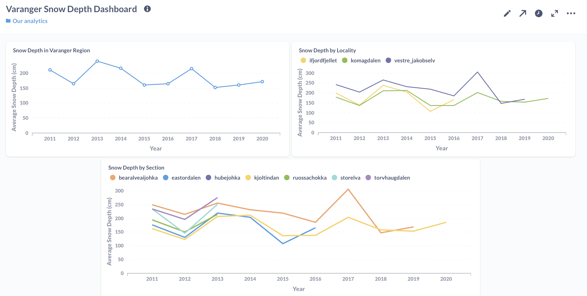
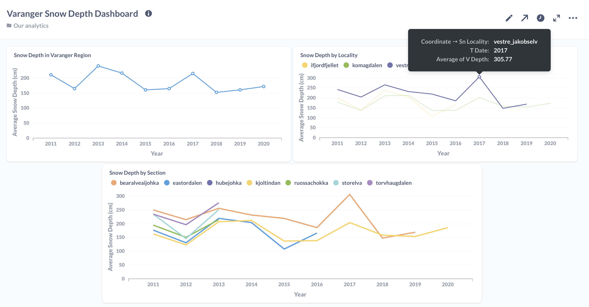
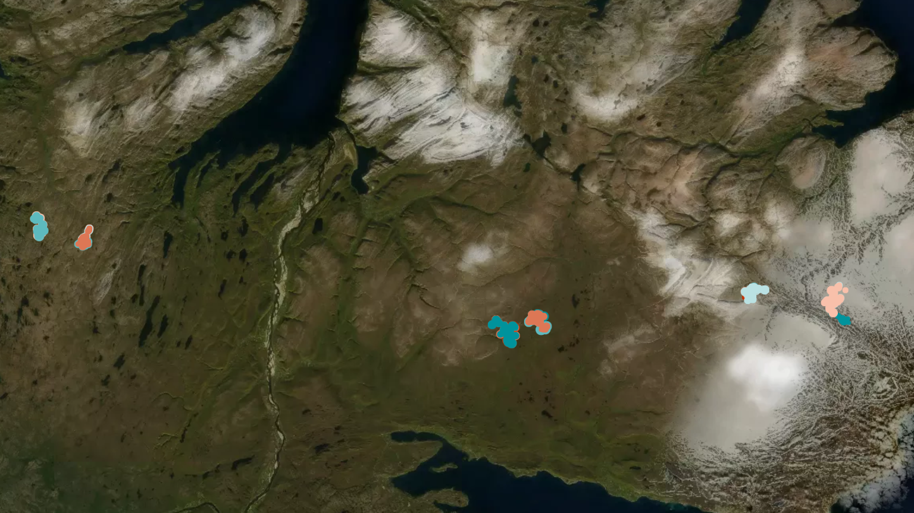

## Background

 As part of the [Hack The Artic's](https://hackthearctic.com/) hackathon, the team developed an **end-to-end containerized pipeline and developed a dashboard** that tracks snow depth at varying levels of granualirty: the entire Vanager region, among the 3 localities, and among the 6 sections. It is also interactive and supports features such as hovering, zooming and data drill down.

 Link to our submission [here!](https://app.hackjunction.com/projects/hack-the-arctic/view/604d5c7e8e2b090043be2fbe)

---
# Description
Due to climate change, global average temperatures have been rising. The changing snow depth in regions near the Arctic help us better understand the ecological impacts of climate change. Some areas with normally deep levels of snow in the past are now getting more shallow. This also affects the habitat of animals in the local area, and it may force them to migrate to other areas. Analyzing data on snow depth is thus crucial not only for validating and monitoring the effects of climate change, but also to track which areas are more affected, so that we can adapt accordingly.

In Norway, in the Varanger region, there are over 100 observation sites set up to track the snow depth. Snow depth is measured yearly. Here we developed a dashboard and visualizations to show and monitor the data from those sites. The team has developed an end-to-end data visualization pipeline automating the entire data ingestion and formatting process and deployed into a live interactive dashboard.

The dashboard tracks snow depth at varying levels of granualirty: the entire Vanager region, among the 3 localities, and among the 6 sections. It is also interactive and supports features such as hovering, zooming and data drill down.

## Workflow
This is the diagram which illustrates the systems design and workflow

## Setup
- `cd` to this directory
- Open a terminal, create a Python virtual environment using:


```
Windows
> python -m virtualenv .venv

Mac/Linux
$ make build

```
then activate it by executing 

```
Windows:
> .venv\Scripts\activate.bat
```
(For Windows) Install dependencies using:
```
> python -m pip install -r requirements.txt
```

## Get [COAT](https://data.coat.no/) data
Download snowdepth zip file and extract to `data` folder with this command
```
Windows
> python app\scraper.py
> python app\etl.py

Mac/Linux
$ make run
```


## Build Docker containers
Now that we have the CSV files in the `data` folder, we can now build our Docker containers using this command:
```
docker-compose up
```

This command will build our `dbt`, `postgres`, and `metabase` containers. This will also run our data loading, transformations, and modeling in the background.

## Transform, model, and load data to Postgres DB using dbt
During `docker-compose`, dbt runs the following commands
- `dbt init snowdepth`: Creates the project folder
- `dbt debug`: Checks the connection with the Postgres database
- `dbt deps`: Installs the test dependencies
- `dbt seed`: Loads the CSV files into staging tables in the database in `postgres`
- `dbt run`: Runs the transformations and loads the data into the database
- `dbt test`: Tests the models
- `dbt docs generate`: Generates the documentation of the dbt project
- `dbt docs serve`: Serves the documentation on a webserver

## Serve to Metabase dashboard
Now that the data is loaded and transformed in our database, we may now view it in http://localhost:3000.
You may need to login, the credentials are 
```
email: dbt@metabase.com
password: password1
```

## Snow Depth Monitoring Dashboard built on Metabase
We built a dashboard tracking the snow depth in the Varanger region in Norway. This is crucial for monitoring the effects of climate change on rising average global temperatures.

The dashboard tracks snow depth at varying levels of granualirty: the entire Vanager region, among the 3 localities, and among the 6 sections.


The dashboard is also interactive and supports features such as hovering and zooming.


## Interactive Map with [Kepler](https://kepler.gl/demo/map?mapUrl=https://dl.dropboxusercontent.com/s/a68w427xd06l15v/keplergl_vbthnva.json)
